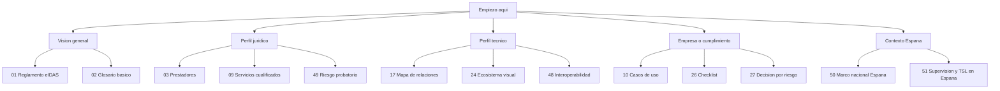

# 00. Guia rapida del tutorial eIDAS

## Introduccion

Este documento sirve como puerta de entrada rapida al proyecto. Si no quieres recorrer de inmediato todo el tutorial, aqui tienes una orientacion breve para entender que leer primero segun tu perfil o necesidad.

## Que es este proyecto en una frase

Es un tutorial divulgativo sobre el marco europeo eIDAS, la identidad digital, los servicios de confianza y la evolucion hacia eIDAS 2.0 y la Cartera Europea de Identidad Digital.

## Si solo quieres una vision general

Empieza por estas secciones:

1. [Que es el reglamento eIDAS](./01-reglamento-eidas.md)
2. [Glosario basico de terminos eIDAS](./02-glosario-eidas.md)
3. [Firma electronica simple, avanzada y cualificada](./04-firma-electronica.md)
4. [Prestadores de servicios de confianza](./03-prestadores-servicios-confianza.md)
5. [eIDAS 2.0 y la Cartera Europea de Identidad Digital](./11-eidas-2.md)

## Si vienes de un perfil juridico

El orden recomendado es este:

1. [Que es el reglamento eIDAS](./01-reglamento-eidas.md)
2. [Prestadores de servicios de confianza](./03-prestadores-servicios-confianza.md)
3. [Servicios de confianza cualificados](./09-servicios-confianza-cualificados.md)
4. [Cadena de evidencia y riesgo probatorio](./49-cadena-evidencia-riesgo-probatorio.md)
5. [Marco nacional y contexto de Espana](./50-espana-marco-nacional.md)

## Si vienes de un perfil tecnico

El orden recomendado es este:

1. [Mapa de relaciones entre firma, sello, certificado y wallet](./17-mapa-relaciones.md)
2. [Esquema visual del ecosistema eIDAS](./24-ecosistema-visual.md)
3. [Interoperabilidad y reconocimiento transfronterizo](./48-interoperabilidad-transfronteriza.md)
4. [Conservacion y validacion](./22-conservacion-y-validacion.md)
5. [Custodia operativa de evidencias](./46-custodia-operativa.md)

## Si vienes de empresa o cumplimiento

El orden recomendado es este:

1. [Casos de uso reales](./10-casos-de-uso.md)
2. [Comparativa entre usos empresariales y administrativos](./15-comparativa-empresa-administracion.md)
3. [Checklist de implantacion](./26-checklist-implantacion.md)
4. [Cuadro de decision por nivel de riesgo](./27-cuadro-decision-riesgo.md)
5. [Buenas practicas para empresa y Administracion](./31-buenas-practicas.md)

## Si quieres entender rapidamente Espana dentro de eIDAS

Empieza por:

1. [Que es el reglamento eIDAS](./01-reglamento-eidas.md)
2. [Marco nacional y contexto de Espana](./50-espana-marco-nacional.md)
3. [Supervision, TSL y prestadores en Espana](./51-espana-supervision-tsl.md)

## Mapa de entrada rapido

## Idea clave para leer el tutorial

No hace falta leerlo todo seguido. El proyecto esta pensado para que puedas entrar por bloques y volver luego al resto con mas contexto.

## Resumen rapido

La guia rapida ayuda a elegir por donde empezar segun el perfil del lector y evita que el indice completo resulte abrumador en una primera visita.
