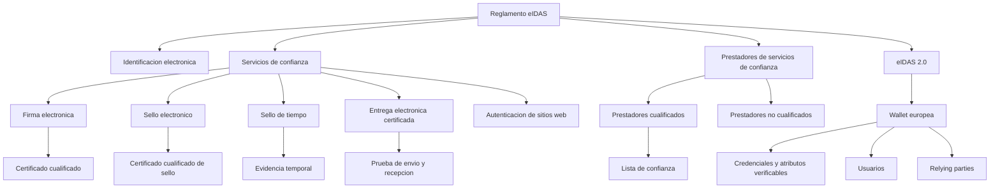

# 24. Esquema visual del ecosistema eIDAS

## Introduccion

Este esquema ofrece una vision sintetica de como se relacionan los elementos principales del ecosistema eIDAS.

## Como leerlo

- el reglamento eIDAS es la base del sistema
- de el salen dos grandes bloques: identificacion electronica y servicios de confianza
- los prestadores hacen operativos esos servicios
- la lista de confianza ayuda a verificar el nivel cualificado
- eIDAS 2.0 amplifica el marco con la wallet europea

## Utilidad del esquema

Este diagrama no sustituye a las definiciones juridicas, pero ayuda a visualizar rapidamente como encajan las piezas principales del sistema.

## Resumen rapido

El ecosistema eIDAS conecta normas, prestadores, servicios, certificados, evidencias y, en la nueva etapa, wallets y credenciales verificables.
