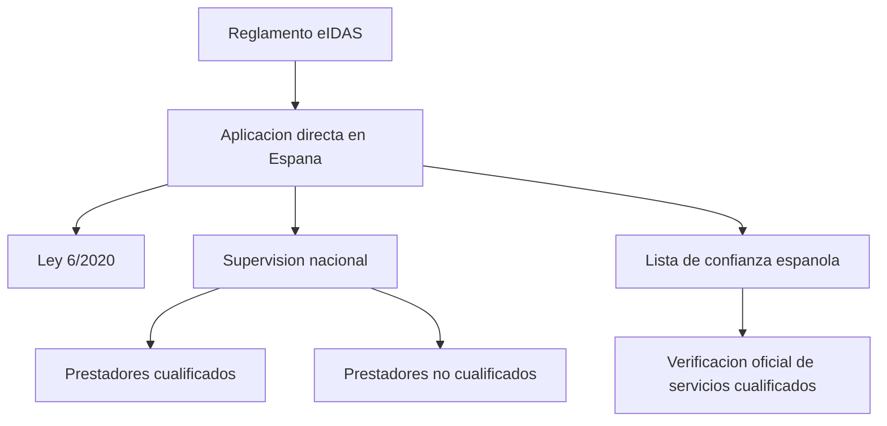

# 50. Marco nacional y contexto de Espana

## Introduccion

Aunque eIDAS es un reglamento europeo directamente aplicable, su aterrizaje practico en Espana requiere entender el contexto nacional, las autoridades implicadas y la normativa complementaria.

Este capitulo no presenta a Espana como una excepcion al sistema europeo, sino como uno de sus marcos nacionales de aplicacion y supervision.

## Punto de partida importante

Conviene recordar una idea basica:

- eIDAS no se transpone en sentido estricto
- eIDAS se aplica directamente
- el ordenamiento espanol lo complementa y desarrolla en determinados aspectos

Esta precision es importante para no mezclar categorias juridicas distintas.

## Norma nacional de referencia

La referencia espanola mas relevante para este tutorial es la `Ley 6/2020, de 11 de noviembre, reguladora de determinados aspectos de los servicios electronicos de confianza`.

Su funcion principal no es sustituir a eIDAS, sino encajar determinados aspectos del sistema en el marco espanol.

## Para que sirve el contexto nacional

El marco nacional ayuda a concretar:

- como se organiza la supervision
- como se publican determinadas listas y referencias oficiales
- como se articula la actividad de prestadores en Espana
- que autoridades y canales oficiales conviene consultar

Por eso, aunque el reglamento europeo sea el centro del sistema, el contexto espanol sigue siendo importante en la practica.

## Temas donde Espana importa especialmente

Hay varias cuestiones en las que el lector suele necesitar una referencia nacional:

- supervision de prestadores
- lista de confianza espanola
- comunicacion de servicios no cualificados
- referencias administrativas oficiales
- encaje practico para empresa y Administracion

## Relacion entre marco europeo y marco espanol

Puede resumirse asi:

## Perspectiva practica

Para quien trabaja en Espana, esto significa que no basta con conocer la categoria europea en abstracto. Tambien conviene saber:

- donde comprobar un prestador
- que fuente oficial consultar
- que rol juega la Administracion espanola
- como se integra todo ello con el marco comun de la Union

## Error frecuente

Un error comun es creer que, por ser eIDAS directamente aplicable, el contexto nacional deja de importar.

No es asi. Importa menos como fuente basica del sistema, pero sigue siendo decisivo para la operativa real, la supervision y la consulta de referencias oficiales.

## Relacion con otras secciones del tutorial

Este capitulo conecta especialmente con:

- [Que es el reglamento eIDAS](./01-reglamento-eidas.md)
- [Prestadores de servicios de confianza](./03-prestadores-servicios-confianza.md)
- [Actores institucionales y supervisores](./12-actores-institucionales.md)
- [Supervision, TSL y prestadores en Espana](./51-espana-supervision-tsl.md)

## Resumen rapido

En Espana, eIDAS se aplica directamente y se complementa con normativa y estructuras nacionales de supervision. Entender ese encaje ayuda a interpretar mejor las fuentes oficiales y a moverse con mas seguridad dentro del sistema.
