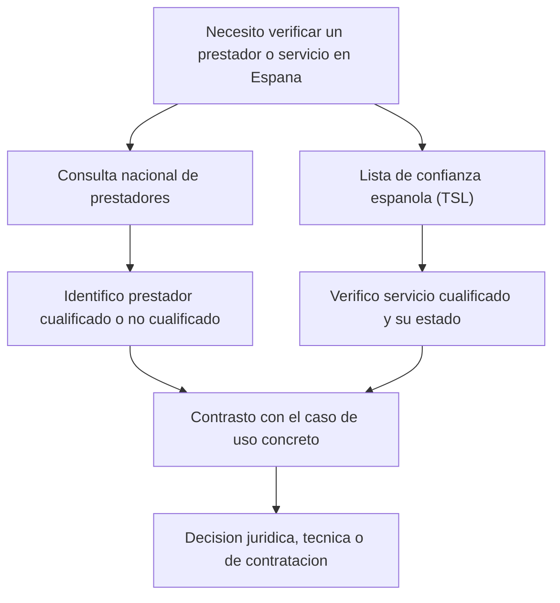

# 51. Supervision, TSL y prestadores en Espana

## Introduccion

Despues de entender el marco general, una de las preguntas mas practicas es esta: donde se comprueba en Espana si un prestador o un servicio tiene condicion de cualificado.

La respuesta pasa por tres piezas:

- la supervision nacional
- la publicacion de referencias oficiales
- la `lista de confianza (TSL)` espanola

## Supervision en Espana

En Espana, la informacion institucional consultada para este proyecto situa la supervision y la publicacion de referencias oficiales dentro del esquema administrativo actualmente vinculado al `Ministerio para la Transformacion Digital y de la Funcion Publica`.

Esto se refleja en la existencia de:

- consultas de prestadores cualificados
- consultas de prestadores no cualificados
- TSL espanola
- referencias administrativas y tecnicas publicadas por la Administracion

## Que es la TSL espanola

La `lista de confianza (TSL)` espanola es el instrumento oficial que publica informacion estructurada sobre prestadores cualificados y servicios cualificados bajo supervision espanola.

No es un simple listado divulgativo. Tiene valor practico porque permite verificar el estado oficial de determinados servicios dentro del sistema eIDAS.

## Que puede comprobarse en la TSL

Entre otras cosas, la TSL permite comprobar:

- nombre del prestador
- tipo de servicio
- condicion de cualificado
- estado del servicio
- marco nacional de supervision

## Consulta nacional de prestadores

Ademas de la TSL, existen consultas nacionales que facilitan la localizacion de:

- prestadores cualificados
- prestadores no cualificados

Estas herramientas son utiles para trabajo operativo y para comprobaciones preliminares, aunque cuando se necesita mas rigor tecnico o evidencial la TSL sigue siendo una referencia central.

## Diagrama de consulta practica

## Cuando conviene revisar estas fuentes

Conviene acudir a estas referencias especialmente cuando:

- se va a contratar un servicio de confianza
- se necesita defender la cualificacion de un servicio
- se revisa una evidencia digital
- se analiza un certificado o servicio con posible relevancia probatoria

## Precaucion importante

Las listas y estados pueden cambiar con el tiempo. Por eso no conviene basarse en capturas antiguas, referencias comerciales o listados secundarios si el caso requiere actualidad o rigor formal.

## Enlaces oficiales utiles

- [Ley 6/2020 en el BOE](https://www.boe.es/buscar/act.php?id=BOE-A-2020-14046)
- [Consulta de prestadores cualificados](https://sedeaplicaciones.minetur.gob.es/prestadores/)
- [Consulta de prestadores no cualificados](https://sedeaplicaciones.minetur.gob.es/Prestadores/NoCualificados.aspx)
- [TSL de Espana](https://sedediatid.mineco.gob.es/Prestadores/TSL/TSL.xml)
- [TSL de Espana en PDF](https://sedediatid.mineco.gob.es/Prestadores/TSL/TSL.pdf)

## Relacion con otras secciones del tutorial

Este capitulo conecta especialmente con:

- [Prestadores de servicios de confianza](./03-prestadores-servicios-confianza.md)
- [Cuadro comparativo entre prestadores cualificados y no cualificados](./19-cuadro-prestadores.md)
- [Marco nacional y contexto de Espana](./50-espana-marco-nacional.md)

## Resumen rapido

Para verificar en Espana la posicion oficial de un prestador o de un servicio, conviene acudir a la supervision nacional, a las consultas oficiales y, sobre todo, a la `lista de confianza (TSL)` cuando haga falta una comprobacion mas formal.
